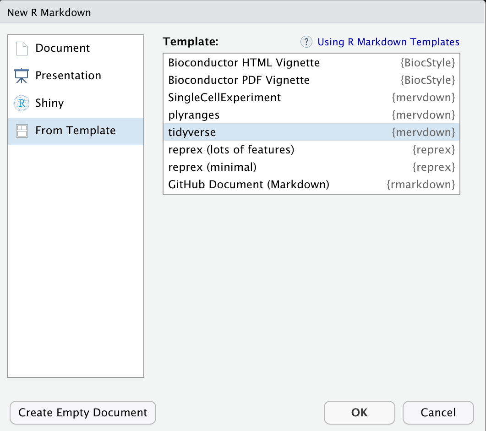

<!-- README.md is generated from README.Rmd. Please edit that file -->

# mervdown

<!-- badges: start -->

[](https://github.com/mfansler/mervdown/actions)
<!-- badges: end -->

This package collects a set of *opinionated* R Markdown templates the
author uses for scientific data analysis. Feel free to use, copy, or
fork.

Opinionated features common to all templates include:

-   dates based on time-of-render
-   floating ToC
-   folding code
-   pre-written section and sub-section headers
-   comment prompts for what questions each section should answer
-   reproducibility info in footer (`sessionInfo()` and
    `conda env export` output)

## Installation

The author primarily manages R environments with
[Mamba](https://mamba.readthedocs.io/en/latest/), so releases go
directly to Anaconda Cloud. To install with Mamba (or Conda), use

``` bash
# conda install -n base conda-forge::mamba
mamba install merv::mervdown
```

For native R installations, one can install from GitHub, either through
`devtools`

``` r
# install.packages("devtools")
devtools::install_github("mfansler/mervdown")
```

or through `BiocManager`

``` r
# install.packages("BiocManager")
BiocManager::install("mfansler/mervdown")
```

## Usage

After installation, templates are available through RStudio under

> **File \> New File \> R Markdown…**

then selecting the **From Template** section in the **New R Markdown**
dialog box:

<figure>
<figcaption aria-hidden="true">New R Markdown dialog box with <strong>mervdown</strong> templates</figcaption>
</figure>

## Forking

Note that Conda recipe code is maintained on the `conda` branch and
includes a GitHub Action for pushing to an Anaconda Cloud account. This
is maintained on a separate branch for modularity and is configured to
launch on recipe changes.

## Feedback

Feedback is welcome through GitHub, but please be aware these templates
are intended for personal use and come with no pretense of developer
support.
